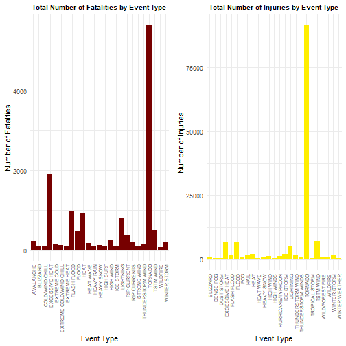

### Synopsis
The main purpose of this analysis is to understand the real impact of historical weather events in the United States from 1950 to 2011. To do this, we use the US National Oceanic and Climate Administration (NOAA) storm database.  
The analysis measures the impact on human health and the economy. As a result of the analysis, the 25 most influential types of events were selected. The factor of influence of events on health is the number of deaths and the number of injuries. The factor affecting the economy is the cost of losses caused by the event.

### Data Processing
1. Loading packages  

Load all the required packages for this anaylsis.

```r
sapply(c("ggplot2", "R.utils", "dplyr", "grid"), 
       function(x) { 
           if(!require(x, character.only = TRUE)) install.packages(x) 
           library(x, character.only = TRUE)
           TRUE })
```


2. Loading data


```r
if(!file.exists("data.csv")) {
    download.file(url = "https://d396qusza40orc.cloudfront.net/repdata%2Fdata%2FStormData.csv.bz2",
                  destfile = "data.csv.bz2")
    bunzip2("data.csv.bz2")
}

data <- read.csv("data.csv", stringsAsFactors = FALSE)
```


```r
names(data)
```

```
##  [1] "STATE__"    "BGN_DATE"   "BGN_TIME"   "TIME_ZONE"  "COUNTY"     "COUNTYNAME" "STATE"     
##  [8] "EVTYPE"     "BGN_RANGE"  "BGN_AZI"    "BGN_LOCATI" "END_DATE"   "END_TIME"   "COUNTY_END"
## [15] "COUNTYENDN" "END_RANGE"  "END_AZI"    "END_LOCATI" "LENGTH"     "WIDTH"      "F"         
## [22] "MAG"        "FATALITIES" "INJURIES"   "PROPDMG"    "PROPDMGEXP" "CROPDMG"    "CROPDMGEXP"
## [29] "WFO"        "STATEOFFIC" "ZONENAMES"  "LATITUDE"   "LONGITUDE"  "LATITUDE_E" "LONGITUDE_"
## [36] "REMARKS"    "REFNUM"
```

For analysis we interesting in columns:  

- EVTYPE
- FATALITIES
- INJURIES
- PROPDMG
- PROPDMGEXP
- CROPDMG
- CROPDMGEXP


```r
HealthDamage <- data %>% select(EVTYPE, FATALITIES, INJURIES)
EconomicDamage <- data %>% select(EVTYPE, PROPDMG, PROPDMGEXP, CROPDMG, CROPDMGEXP)
```

3. Processing data

To assess the impact of natural events on human health, we calculate the total number of fatalities and numbers of injuries caused by different types of events.


```r
total_FATALITIES <- aggregate(FATALITIES ~ EVTYPE, HealthDamage, sum)
total_INJURIES <- aggregate(INJURIES ~ EVTYPE, HealthDamage, sum)
```

For a more visual representation, we will sort the data by the total number of events caused by the phenomenon, and select the 25 most dangerous events.


```r
total_FATALITIES <- total_FATALITIES[order(-total_FATALITIES$FATALITIES), ][c(1:25), ]
total_INJURIES <- total_INJURIES[order(-total_INJURIES$INJURIES), ][c(1:25), ]
```


```r
head(total_FATALITIES)
```

```
##             EVTYPE FATALITIES
## 834        TORNADO       5633
## 130 EXCESSIVE HEAT       1903
## 153    FLASH FLOOD        978
## 275           HEAT        937
## 464      LIGHTNING        816
## 856      TSTM WIND        504
```

```r
head(total_INJURIES)
```

```
##             EVTYPE INJURIES
## 834        TORNADO    91346
## 856      TSTM WIND     6957
## 170          FLOOD     6789
## 130 EXCESSIVE HEAT     6525
## 464      LIGHTNING     5230
## 275           HEAT     2100
```

According to Storm Data Documentation, there are only references about what mean the “K”, “M” and “B” considering the damage costs. Particularly, the document explains: “Alphabetical characters used to signify magnitude include”K" for thousands, “M” for millions, and “B” for billions. So we only considered the cases labeled by “K”, “M” or “B”, basically because they include the main cases.


```r
dict <- c("B" = 10^9,
          "M" = 10^6,
          "K" = 10^3,
          "-" = 0)
EconomicDamage$PROPDMGEXP[!(EconomicDamage$PROPDMGEXP %in% c("B", "M", "K"))] <- "-"
EconomicDamage$PROPDMG <- EconomicDamage$PROPDMG * unname(dict[EconomicDamage$PROPDMGEXP])
EconomicDamage$CROPDMGEXP[!(EconomicDamage$CROPDMGEXP %in% c("B", "M", "K"))] <- "-"
EconomicDamage$CROPDMG <- EconomicDamage$CROPDMG * unname(dict[EconomicDamage$CROPDMGEXP])
EconomicDamage[, c("PROPDMGEXP", "CROPDMGEXP")] <- list(NULL)
```


```r
head(EconomicDamage)
```

```
##    EVTYPE PROPDMG CROPDMG
## 1 TORNADO   25000       0
## 2 TORNADO    2500       0
## 3 TORNADO   25000       0
## 4 TORNADO    2500       0
## 5 TORNADO    2500       0
## 6 TORNADO    2500       0
```

To assess the impact of natural events on economy, we calculate the cost in PROP and CROP caused by different types of events.


```r
total_EconomicDamage <- aggregate(PROPDMG ~ EVTYPE, EconomicDamage, sum)
total_EconomicDamage$CROPDMG <- aggregate(CROPDMG ~ EVTYPE, EconomicDamage, sum)$CROPDMG
total_EconomicDamage$Total <- total_EconomicDamage$PROPDMG + total_EconomicDamage$CROPDMG
```

```r
head(total_EconomicDamage)
```

```
##                  EVTYPE PROPDMG CROPDMG   Total
## 1    HIGH SURF ADVISORY  200000       0  200000
## 2         COASTAL FLOOD       0       0       0
## 3           FLASH FLOOD   50000       0   50000
## 4             LIGHTNING       0       0       0
## 5             TSTM WIND 8100000       0 8100000
## 6       TSTM WIND (G45)    8000       0    8000
```

### Result
1. Across the United States, which types of events (as indicated in the EVTYPE variable) are most harmful with respect to population health?


```r
plot1 <- ggplot(total_FATALITIES, aes(EVTYPE, FATALITIES)) +
    geom_col(fill = "#770000") +
    labs(x = "Event Type", y = "Number of Fatalities",
         title = "Total Number of Fatalities by Event Type") +
    theme_minimal() +
    theme(plot.title = element_text(hjust = 0.5, face = "bold", size = 10), 
                            axis.text.x = element_text(angle = 90, hjust = 1, vjust = 0.5, size = 7))

plot2 <- ggplot(total_INJURIES, aes(EVTYPE, INJURIES)) +
    geom_col(fill = "#FFEE00") +
    labs(x = "Event Type", y = "Number of Injuries",
         title = "Total Number of Injuries by Event Type") +
    theme_minimal() +
    theme(plot.title = element_text(hjust = 0.5, face = "bold", size = 10), 
                            axis.text.x = element_text(angle = 90, hjust = 1, vjust = 0.5, size = 7))

figure1 <- multiplot(plot1, plot2, cols = 2)
```



2. Across the United States, which types of events have the greatest economic consequences?


```r
plot3 <- ggplot(total_EconomicDamage[order(-total_EconomicDamage$PROPDMG), ][c(1:25), ],
                aes(EVTYPE, PROPDMG / 10^9)) +
    geom_col() +
    labs(x = "Event Type", y = "Cost in PROP (Billion Dollars)",
         title = "Total Cost in PROP by Event Type (Billion Dollars)") +
    theme_minimal() +
    theme(plot.title = element_text(hjust = 0.5, face = "bold", size = 8), 
          axis.text.x = element_text(angle = 90, hjust = 1, vjust = 0.5, size = 7))    

plot4 <- ggplot(total_EconomicDamage[order(-total_EconomicDamage$CROPDMG), ][c(1:25), ],
                aes(EVTYPE, CROPDMG / 10^9)) +
    geom_col() +
    labs(x = "Event Type", y = "Cost in CROP (Billion Dollars)",
         title = "Total Cost in CROP by Event Type (Billion Dollars)") +
    theme_minimal() +
    theme(plot.title = element_text(hjust = 0.5, face = "bold", size = 8), 
          axis.text.x = element_text(angle = 90, hjust = 1, vjust = 0.5, size = 7)) 

figure2 <- multiplot(plot3, plot4, cols = 2)
```


```r
figure3 <- ggplot(total_EconomicDamage[order(-total_EconomicDamage$Total), ][c(1:25), ],
                  aes(EVTYPE, Total / 10^9)) +
    geom_col() +
    labs(x = "Event Type", y = "Cost in PROP & CROP (Billion Dollars)",
         title = "Total Cost in PROP & CROP by Event Type (Billion Dollars)") +
    theme_minimal() +
    theme(plot.title = element_text(hjust = 0.5, face = "bold", size = 10), 
          axis.text.x = element_text(angle = 90, hjust = 1, vjust = 0.5, size = 7))
```


